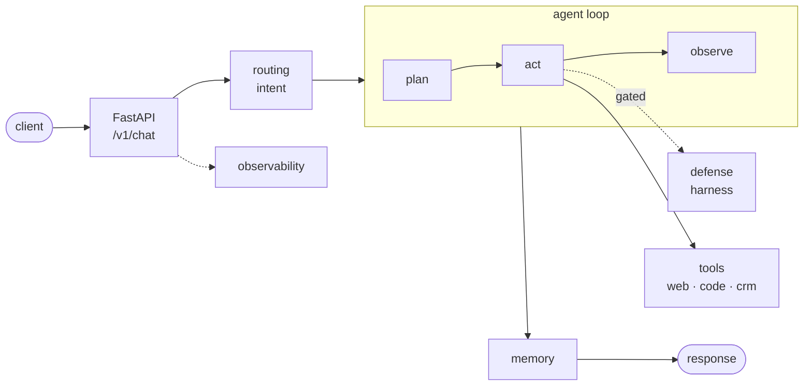

# production-agent

A **runnable, production-shaped AI agent**, developed with **Claude Code** as the
primary AI pair-programmer. It pairs two blueprints:

- **The production-agent architecture** - an agent loop (plan→act→observe), tools,
  layered memory, intent routing, an 8-layer runtime defense harness, evaluation
  with judges, observability, and deploy configs.
- **The Claude Code project anatomy** - a `CLAUDE.md` "project brain" and a
  `.claude/` directory holding settings, rules, commands, skills, sub-agents and hooks.

It serves both as a **starting point for new agent projects** and as a **reference**
for what a production agent repo contains.

> **It runs out of the box.** `make install && make serve` starts a real FastAPI
> agent that classifies intent, calls a tool, gates the call through the defense
> harness, and answers - with **no API key, no database, and no internet** (a
> deterministic `EchoLLM`, in-memory stores, and an audit-mode harness).
> `make check` (lint + type + test) and `make eval` are green on a fresh clone.



Full diagram + the 8 harness layers: [`docs/architecture.md`](docs/architecture.md).
Design rationale: [`docs/decisions/`](docs/decisions/) (ADRs).

```bash
make install            # editable install + dev deps
make serve              # uvicorn on :8000  (offline, no secrets needed)
curl -s localhost:8000/healthz
curl -s localhost:8000/v1/chat -H 'content-type: application/json' \
  -d '{"messages":[{"role":"user","content":"search for the latest agent news"}]}'
make check              # ruff + mypy + pytest   (28 tests)
make eval               # replay evaluation/golden_dataset.json
```

Then run `/init` inside Claude Code to keep `CLAUDE.md` in sync as the code grows.

### What's real vs. what to replace

| Real & runnable now                                    | Stubbed - swap for production                          |
| ------------------------------------------------------ | ------------------------------------------------------ |
| FastAPI app, routes, error envelope                    | -                                                      |
| Agent loop (plan→act→observe), bounded                 | Port to LangGraph (`langgraph` extra) when you outgrow it |
| Heuristic intent classifier + handler registry         | LLM/model classifier                                   |
| 3 tools: `web_search` (canned), `code_search` (ripgrep), `crm` (in-memory) | Real providers / domain systems         |
| In-memory conversation, semantic cache, long-term      | Redis + pgvector (`redis` extra)                       |
| `EchoLLM` (deterministic, offline)                     | `AnthropicLLM` (`anthropic` extra + API key)           |
| Local audit-mode defense harness + `contract.yaml`     | A managed runtime-defense backend (keep the same seam) |
| Eval runner + keyword judge + golden set               | LLM-as-judge, larger golden set                        |

---

## What's in the box

```
.
├── CLAUDE.md                 # Project brain - loaded at session start
├── CLAUDE.local.md.example   # Personal overrides (gitignored when renamed)
├── AGENTS.md                 # Multi-agent collaboration notes
├── .mcp.json                 # External tool connections (MCP)
├── .claudeignore             # Files Claude should never read
├── .claude/
│   ├── settings.json         # Permissions, hooks, env vars (checked in)
│   ├── settings.local.json.example  # Per-machine overrides
│   ├── rules/                # Modular conventions (code-style, testing, API)
│   ├── commands/             # Custom slash commands
│   ├── skills/               # Auto-invoked reusable expertise
│   ├── agents/               # Specialized sub-agents
│   └── hooks/                # Lifecycle event scripts
│
├── app/                      # FastAPI entry, config, schemas, Dockerfile
├── agent/                    # Agent core
│   ├── graph.py              #   state machine (plan → act → observe)
│   ├── nodes.py              #   individual graph nodes
│   ├── tools/                #   crm, web_search, code_search (MCP)
│   └── prompts/              #   versioned system + per-intent templates
├── memory/                   # conversation (window), semantic_cache, long_term
├── routing/                  # intent classifier + handler registry
├── security/                 # Runtime defense harness
│   ├── harness.py            #   gates every tool call (8-layer model)
│   └── contract.yaml         #   agent contract: scope, thresholds, control mode
├── evaluation/               # golden_dataset, eval_runner, judges/, results/
├── observability/            # tracer, feedback, cost_tracker
├── data/                     # raw → processed → index config
├── tests/                    # test_agent, test_tools, test_security, test_routing
├── deploy/                   # docker-compose (dev) + docker-compose.prod (GPU, hardened)
├── docs/                     # architecture, API reference, deployment
├── scripts/                  # seed, migrate, healthcheck (optional helpers)
├── frontend/                 # optional UI, containerized separately
├── pyproject.toml
└── README.md
```

See `docs/architecture.md` for a full walkthrough.

## The runtime defense harness

`security/` wraps the agent in an always-on harness that gates tool calls and
reasoning *before* they execute. The 8 layers (configured in `contract.yaml`):

1. **Define the agent contract** - scope, boundaries, enforcement mode.
2. **Capture actions + reasoning** - intercept tool calls, pair with reasoning, correlate per session.
3. **Scrub PII before it leaves** - client-side regex + server-side LLM sweep.
4. **Analyze the reasoning trace** - catch intent before the action runs.
5. **Harden the analyser** - sandboxed (no tools/MCP/internet), inputs spotlighted as untrusted.
6. **Tier the verdict by severity** - low → critical, per-agent action threshold.
7. **Choose the control mode** - audit · human-in-the-loop · block.
8. **Push alerts to channels** - severity-gated Slack/Discord routing.

> `security/harness.py` is a **self-contained implementation** of this model
> (audit-mode default, fail-safe). It's a provider-agnostic seam: keep the
> interface and delegate to a managed runtime-defense backend, or extend the
> stubbed layers in place. The 8-layer model is inspired by the "production agent"
> reference blueprint; this code depends on no third-party SDK. See
> [ADR-0002](docs/decisions/0002-runtime-defense-harness-as-a-seam.md).

## Getting started

```bash
# 1. Use this repo as a GitHub template, then clone your new project
git clone <your-new-repo>
cd <your-new-repo>

# 2. Copy local config stubs
cp .env.example .env
cp CLAUDE.local.md.example CLAUDE.local.md
cp .claude/settings.local.json.example .claude/settings.local.json

# 3. Install and verify it runs
make install
make check        # lint + type + test (all green)
make serve        # http://localhost:8000

# 4. Open in Claude Code
claude
```

Then:

- Edit `CLAUDE.md` to describe your project (name, purpose, stack).
- Replace stubbed pieces with real ones (see the table above) - the EchoLLM, the
  canned `web_search`, the in-memory stores, and the local harness are seams.
- Run `/init` so Claude keeps `CLAUDE.md` in sync with the live tree.
- Use `/review` and `/fix-issue` (in `.claude/commands/`) for repeatable workflows.
- `pre-commit install` to run the lint/format gate on every commit; CI runs the
  same gate (`.github/workflows/ci.yml`).

## Conventions

- **`CLAUDE.md` is the contract.** Update it whenever architecture or workflow rules change.
- **`.claude/rules/*.md`** are scoped, modular conventions - prefer adding a new rule file over
  bloating `CLAUDE.md`.
- **Hooks block what shouldn't happen** (e.g. `validate-bash.sh` rejects dangerous commands).
- **Sub-agents own isolated context.** Use them for code review, security audits, or any task
  whose results you don't want clogging the main window.
- **MCP servers** live in `.mcp.json` - committed so the whole team shares the same external tools.
- **The agent contract (`security/contract.yaml`) is reviewed like code.** Changes to the agent's
  guardrails go through PR review.
