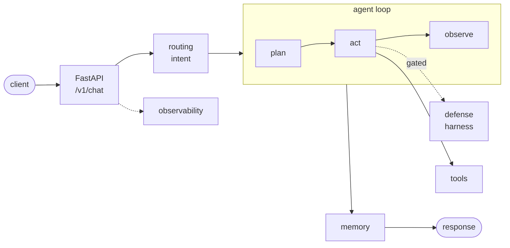

# Production Agent — Project Blueprint

A **reference / anatomy** of a production-shaped AI agent project. Not a runnable
app: every source and config file is a comment-only stub that explains its
**purpose**, **when you want a file like it**, **why it matters**, and a small
**commented example** of what real content would look like.

Use it as a lookup when starting a new AI or agent project: walk the tree, pick
the pieces you need, copy the examples, and skip the rest. It pairs two
mental models you'll see referenced throughout the repo:

- **The Claude Code project anatomy** — `CLAUDE.md` "project brain" + `.claude/`
  (settings, rules, commands, skills, sub-agents, hooks). Reusable across any
  project, not just AI ones.
- **The production-agent architecture** — agent loop (plan → act → observe),
  tools, layered memory, intent routing, an 8-layer runtime defense harness,
  evaluation with judges, observability, deploy configs.

> **Not runnable on purpose.** Treat each file as documentation. When you start
> a new project, copy the *shape* — directory layout, file names, file roles —
> and write the real code in that new repo. Specific projects make the hard
> tradeoffs against a real problem; this repo only describes the menu.



Full diagram + 8-layer harness table: [`docs/architecture.md`](docs/architecture.md).
Design rationale: [`docs/decisions/`](docs/decisions/) (ADRs).

---

## What's in the tree

```
.
├── CLAUDE.md                 # Project brain - loaded at session start
├── CLAUDE.local.md.example   # Personal overrides (gitignored when renamed)
├── AGENTS.md                 # Multi-agent collaboration notes
├── .mcp.json                 # External tool connections (MCP)
├── .claudeignore             # Files Claude should never read
├── .claude/
│   ├── settings.json         # Permissions, hooks, env vars (checked in)
│   ├── settings.local.json.example  # Per-machine overrides
│   ├── rules/                # Modular conventions (code-style, testing, API)
│   ├── commands/             # Custom slash commands
│   ├── skills/               # Auto-invoked reusable expertise
│   ├── agents/               # Specialized sub-agents
│   └── hooks/                # Lifecycle event scripts
│
├── app/                      # FastAPI entry, config, schemas, Dockerfile
├── agent/                    # Agent core
│   ├── graph.py              #   plan → act → observe orchestrator
│   ├── nodes.py              #   individual loop steps
│   ├── llm.py                #   pluggable LLM client (offline default + real provider)
│   ├── tools/                #   one file per tool (crm, web_search, code_search…)
│   └── prompts/              #   versioned system + per-intent templates
├── memory/                   # conversation window, semantic_cache, long_term
├── routing/                  # intent classifier + handler registry
├── security/                 # Runtime defense harness
│   ├── harness.py            #   gates every tool call (8-layer model)
│   └── contract.yaml         #   agent contract: scope, thresholds, control mode
├── evaluation/               # golden_dataset, eval_runner, judges/, results/
├── observability/            # tracer, feedback, cost_tracker
├── data/                     # raw → processed → index config
├── tests/                    # patterns for agent/tool/security/routing/API tests
├── deploy/                   # docker-compose (dev) + docker-compose.prod (hardened)
├── docs/                     # architecture, API reference, deployment, decisions/
├── scripts/                  # seed, migrate, healthcheck (optional helpers)
├── frontend/                 # optional UI, containerized separately
├── pyproject.toml
└── README.md
```

## How to use it

```bash
# 1. Browse it on GitHub or clone for offline reading
git clone <this-repo> production-agent-blueprint
cd production-agent-blueprint

# 2. Start a new project somewhere else
mkdir ../my-new-agent && cd ../my-new-agent
git init

# 3. For each file you need, copy the SHAPE from the blueprint and write the
#    actual code in your new repo. Use the blueprint's "When you want a file
#    like this" sections as a checklist for what to include.
```

The blueprint deliberately doesn't try to be a working starter — that pushed it
toward "generic" without enough specificity to be useful. Instead, a real project
solves a specific problem and earns each file it copies.

## Conventions

- **`CLAUDE.md` is the contract.** It loads at session start; keep it lean and push
  detail into `.claude/rules/*.md`.
- **`.claude/rules/*.md`** are scoped, modular conventions.
- **Hooks block what shouldn't happen** (`validate-bash.sh` rejects dangerous commands).
- **Sub-agents own isolated context** (code review, security audits).
- **MCP servers** live in `.mcp.json`, committed so the team shares the same external tools.
- **The agent contract (`security/contract.yaml`) is reviewed like code.**
- **Non-obvious decisions are ADRs** in `docs/decisions/`.

## Related

- Concrete project repos (built on this shape, with real tools and real evals):
  `<links to follow>`
