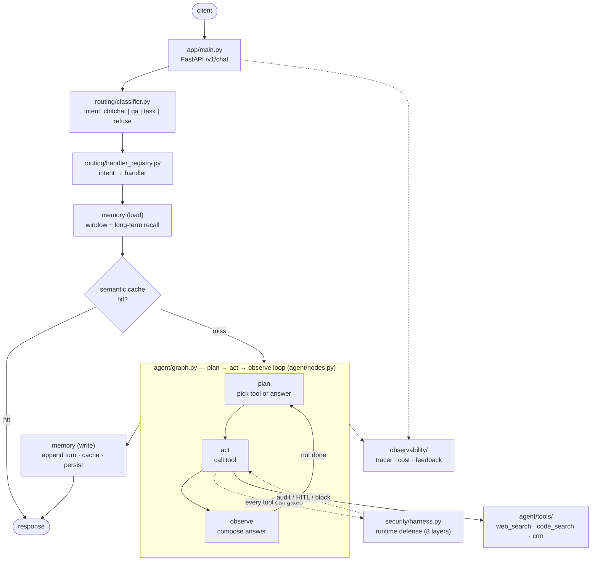

# Architecture

End-to-end view of the production-agent layout: an agent loop wrapped by a runtime
defense harness, with memory, routing, evaluation, and observability around it.

## Request flow



Text fallback of the same flow:

```
client → app/main.py (FastAPI /v1/chat)
       → routing/classifier.py        intent: chitchat | qa | task | refuse
       → routing/handler_registry.py   intent → handler
       → memory (load)                 window + long-term recall
       → semantic cache (hit? short-circuit to response)
       → agent/graph.py                plan → act → observe loop (agent/nodes.py)
            act → agent/tools/{web_search, code_search, crm}
                  every tool call gated by security/harness.py (audit/HITL/block)
       → memory (write)                append turn · cache answer · persist episode
       → response  +  observability/{tracer, cost_tracker, feedback}
```

## The 8-layer runtime defense harness

Configured per agent in `security/contract.yaml`, enforced by `security/harness.py`:

| # | Layer                       | In this repo        | What it does                                                        |
|---|-----------------------------|---------------------|---------------------------------------------------------------------|
| 1 | Define the agent contract   | `contract.yaml`     | Scope, boundaries, enforcement mode.                                |
| 2 | Capture actions + reasoning | in-process          | Intercept tool calls, record verdict events per session.           |
| 3 | Scrub PII before it leaves  | stub (extend)       | Client-side regex + (production) server-side LLM sweep.            |
| 4 | Analyze the reasoning trace | in-process (heuristic) | Catch intent *before* the action runs.                           |
| 5 | Harden the analyser         | managed backend     | Sandboxed (no tools/MCP/internet); inputs spotlighted as untrusted. |
| 6 | Tier the verdict by severity| in-process          | Multi-tier score (low → critical), per-agent action threshold.      |
| 7 | Choose the control mode     | in-process          | Audit · human-in-the-loop · block; tool calls gated pre-execution.  |
| 8 | Push alerts to channels     | stub (extend)       | Severity-gated Slack/Discord; payload = verdict + reasoning + action.|

> `security/harness.py` is a self-contained implementation of this model: layers
> 1–2, 6–7 work as shipped (audit-mode default, fail-safe); layers 3–5, 8 are
> deliberately light stubs you extend or delegate to a managed runtime-defense
> backend. The interface stays the same either way - see
> [ADR-0002](decisions/0002-runtime-defense-harness-as-a-seam.md). The 8-layer
> model is inspired by the "production agent" reference blueprint; this code is
> independent and depends on no third-party SDK.

## Layers / ownership

| Layer            | What lives here                                       | Owns                       |
| ---------------- | ----------------------------------------------------- | -------------------------- |
| `app/`           | HTTP routes, config, schemas, lifecycle               | I/O contract               |
| `routing/`       | Intent classification + handler dispatch              | "what should run"          |
| `agent/`         | Graph, nodes, tools, prompts                          | Task-completing behavior   |
| `memory/`        | Short-term window, semantic cache, long-term store    | What the agent remembers   |
| `security/`      | Runtime defense harness + agent contract              | Safety / enforcement       |
| `observability/` | Tracing, cost, feedback                               | Visibility                 |
| `evaluation/`    | Golden set, eval runner, judges, results              | Quality bar                |

## Claude Code in the loop

- **`CLAUDE.md`** loads at session start and defines the contract above.
- **`.claude/rules/`** carves it into focused, scope-tagged rules.
- **`.claude/commands/`** captures repeatable workflows (`/review`, `/fix-issue`).
- **`.claude/skills/`** ships reusable expertise that auto-invokes on context match.
- **`.claude/agents/`** isolates risky review work (code-reviewer, security-auditor).
- **`.claude/hooks/`** runs deterministic checks at lifecycle events.
- **`.mcp.json`** wires in external tools (GitHub for `code_search`, Postgres, Slack).
